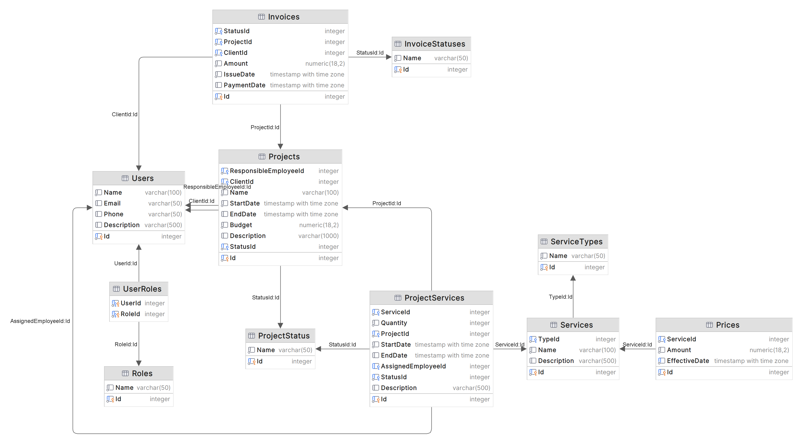

# Design and Construction of SPA Complexes

This is a Web API project for managing the design and construction process of SPA complexes. It is developed using .NET 8.0, Entity Framework, and PostgreSQL.

## Entity–relationship diagram
